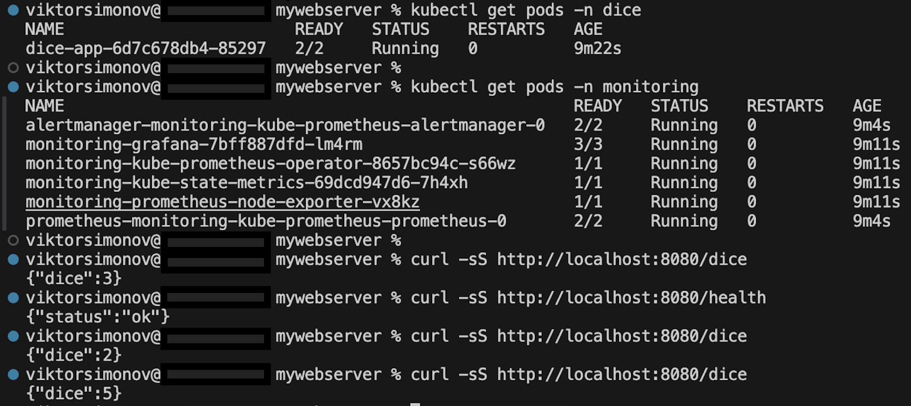
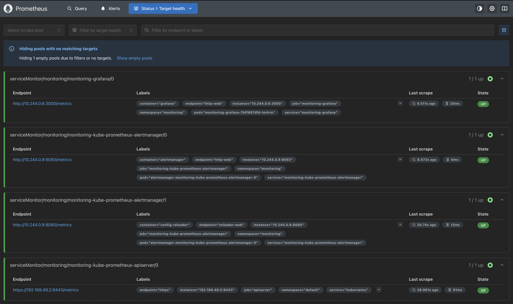
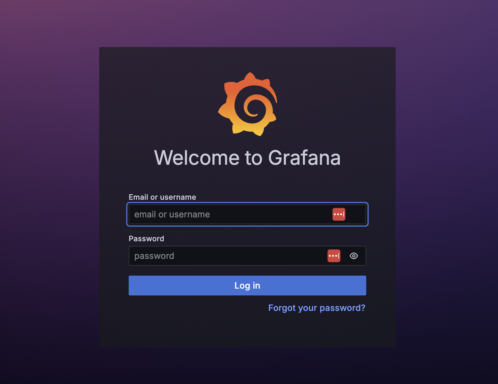
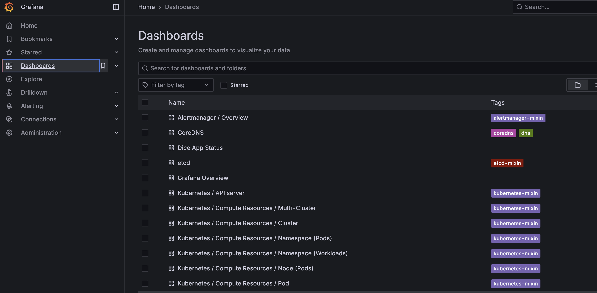

🎲 Dice App on Kubernetes with Monitoring

This project demonstrates a simple Flask-based Dice App deployed into a local Kubernetes cluster (via minikube) together with Prometheus + Grafana monitoring.

The app exposes:

/health → readiness/liveness probe

/dice → returns a random dice roll (1–6)

/metrics → Prometheus-compatible metrics (app_ready, dice_rolls_total)

Grafana dashboard and Prometheus alerts for the app are provisioned automatically.

-------

📋 Prerequisites

Linux or macOS

Git

Internet connection (the script installs everything you need: Docker, minikube, kubectl, helm)

⚠️ On Windows use WSL2
 with Ubuntu.

-------

🚀 Quickstart

Just download, set 755 rights on the deployment script app_deploy.sh from this repository and launch it (or you may clone the whole repo and also set 755 on the script and launch it):

chmod +x app_deploy.sh
./app_deploy.sh

( OR: git clone https://github.com/vsimonovgit/k8s_dice.git
cd k8s_dice
chmod +x app_deploy.sh
./app_deploy.sh )

The script will:

Install Docker, kubectl, minikube, and helm (if missing).

Start a local Kubernetes cluster with minikube and enable ingress-nginx.

Build and load the Docker image into minikube.

Deploy the Dice App (Deployment, Service, Ingress, ServiceMonitor).

Install kube-prometheus-stack via Helm with custom values.

Apply Grafana dashboard and Prometheus alert rules for the Dice App.

Warm up the app by hitting /dice multiple times.

Port-forward and automatically open:

Grafana → http://localhost:3000

Prometheus → http://localhost:9090/targets

------

🔎 Manual Verification

Check that the app responds:

# via Ingress
curl -s http://localhost/health
curl -s http://localhost/dice

# via port-forward (alternative)
kubectl -n dice port-forward svc/dice-svc 8080:80 &
curl -s http://127.0.0.1:8080/health
curl -s http://127.0.0.1:8080/dice

Check Prometheus targets:

kubectl -n monitoring port-forward svc/monitoring-kube-prometheus-prometheus 9090:9090
open http://localhost:9090/targets

Check Grafana dashboards:

kubectl -n monitoring port-forward svc/monitoring-grafana 3000:80
open http://localhost:3000

Default credentials (unless overridden by secret):

user: admin
password: <generated by script>

-------

🛠️ Useful Commands

Rebuild app image and restart deployment:

docker build -t dice-app:latest .
minikube image load dice-app:latest
kubectl -n dice rollout restart deploy/dice-app

Tear down the cluster:

minikube delete --all --purge
docker system prune -af --volumes

-------

📊 Metrics & Alerts

app_ready → readiness gauge (1/0)

dice_rolls_total → counter of dice rolls

Example PromQL queries:

app_ready
sum(rate(dice_rolls_total[1m]))

Grafana dashboard “🎲 Dice App Status” is provisioned automatically.

-----

Running pods:

Prometheus targets:

Grafana:

